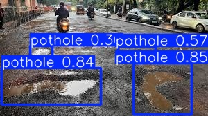
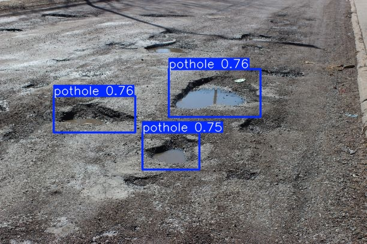

# Pothole Detection System: YOLO + OpenCV + Flask

This is a flask-based pothole detection system using a custom trained YOLO model. The model accepts images and videos as input, 
and performs real time potholes detection.

## Features

### yolo_model_training.ipynb

* Loaded a kaggle dataset of pothole images and trained a yolo26n.pt model with 
    - epoch of 50 and early stopping(patience level = 10). Training stopped at 38th epoch as there was no imporvement observed 
      after 10 epoch, best result was observed at 28 and the model was saved as best.pt.
    - removed the previous data from the trained model and tested with two sample inputs.
    - Downloaded the model locally to use in the flask application.

### app.py

* '/detect_potholes_images' POST: 
   1. Takes an image as input
   2. Image is converted into a numpy array
   3. Opencv accepts the numpy array and decode into actual image
   4. Image is sent to YOLO model
   5. Model detects potholes in the image
   6. Returns detection results object

* '/detect_potholes_videos' POST:
    1. Takes a video as input
    2. video is captured using cv2(OpenCV)
    3. Retrieve height and width of the video to maintain config
    4. Retrieve fps(frame per second)
    5. Model is applied to the frames 
    6. Returns the detected video and save it in 'source/' folder

## Tech Stack:

1. Python
2. Flask
3. OpenCV
4. You Only Look Once(YOLO)

## Sample Outputs:

1. Potholes detected in a video

[Click here to watch the output video](source/output_potholes_video.mp4)

2. Potholes detected in a image

